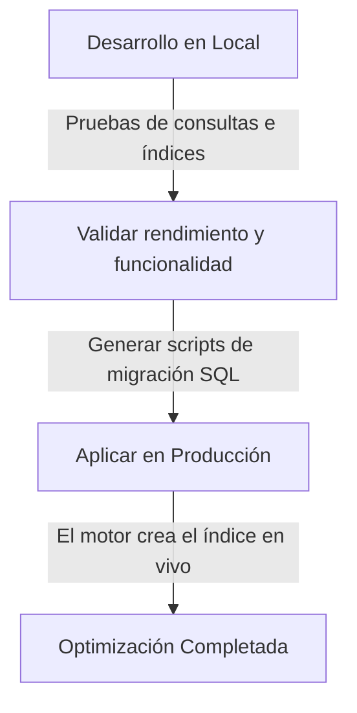

# Optimización y Escalamiento de la Base de Datos

Este documento sirve como referencia para entender cómo mejorar el rendimiento de la base de datos de la aplicación ante el incremento de usuarios concurrentes, asegurando la integridad de los datos durante el proceso.

---

## 1. Estrategia de Crecimiento y Concurrencia

### Estado Actual vs. Escenarios Futuros
* **Estado actual:** ~55 usuarios en total, con un pico de 2 o 3 usuarios simultáneos.
* **Escala media (500 a 1000 usuarios simultáneos):** Requiere optimizaciones a nivel de base de datos y backend.
* **Escala alta (3000+ usuarios simultáneos):** Requiere escalado de infraestructura, caché y distribución de carga.

### Acciones Recomendadas por Nivel de Carga

#### Escala Actual (Básica)
Para la carga actual, la base de datos funciona holgadamente. No se requieren cambios complejos, pero se deben seguir buenas prácticas de desarrollo:
* **Uso de Índices Básicos:** Crear índices en columnas clave (llaves foráneas, correos de usuarios, columnas de estado, etc.). Evita búsquedas lentas a medida que crecen las filas.
* **Evitar Consultas N+1:** Asegurar que el backend no realice múltiples consultas a la base de datos dentro de bucles.
* **Configuración del Connection Pool:** Mantener activo el pool de conexiones del framework backend (por ejemplo, HikariCP en Spring Boot) para reutilizar conexiones abiertas.

#### Escala Media (500 - 1000 usuarios concurrentes)
* **Indexación Avanzada:** Crear índices compuestos y analizar planes de ejecución de consultas (`EXPLAIN`).
* **Paginación Estricta:** Limitar el número de registros devueltos por el backend al frontend.
* **Caché en Backend:** Guardar en caché local de la aplicación o memoria rápida datos estáticos o de lectura frecuente.

#### Escala Alta (1000 - 3000+ usuarios concurrentes)
* **Caché Distribuida (Redis/Memcached):** Implementar una capa de caché externa para evitar que las consultas repetitivas de lectura toquen la base de datos principal.
* **Réplicas de Lectura (Read Replicas):** Configurar una base de datos principal de escritura y réplicas secundarias de solo lectura para distribuir la carga de los usuarios que solo consultan datos.
* **Escalamiento Vertical:** Aumentar recursos de hardware (CPU, RAM y almacenamiento SSD rápido) del servidor de base de datos.

---

## 2. Seguridad e Integridad de los Datos (Índices)

### ¿Los índices alteran o borran los datos?
**No. Los datos de la base de datos se mantienen 100% intactos.**
Un índice es una estructura de datos física y separada (por lo general un Árbol B+) que el motor de la base de datos mantiene internamente para apuntar a la ubicación física de las filas.

* **Transparencia:** No requiere modificar la estructura lógica de las tablas ni el formato de los datos. Tus consultas (`SELECT`, `INSERT`, `UPDATE`, `DELETE`) se siguen escribiendo de la misma forma.
* **Costo/Beneficio:** Los índices aumentan radicalmente la velocidad de lectura (`SELECT`), pero consumen un espacio adicional menor en disco y pueden ralentizar muy levemente las escrituras (`INSERT`, `UPDATE`), ya que el motor debe actualizar el índice cada vez que cambia un dato. Por ello, solo indexa columnas usadas en cláusulas `WHERE`, `JOIN` o `ORDER BY`.

---

## 3. Flujo Seguro de Implementación (Local a Producción)

Para garantizar la seguridad de la información, el proceso de optimización se divide en fases sin interrumpir el servicio ni poner en riesgo la producción:

### Paso 1: Trabajo en Entorno Local
1. Se crean los índices y se modifican las consultas pesadas únicamente en la base de datos local de desarrollo.
2. Se valida que la aplicación responda correctamente y que las consultas ahora se ejecuten más rápido.

### Paso 2: Despliegue en Producción
1. Los cambios del código del backend optimizado se suben al servidor mediante tu flujo de despliegue (ej. `deploy-update.sh`).
2. Los nuevos índices se crean en la base de datos de producción mediante comandos SQL directos o herramientas de migración automatizada (como Flyway o Luz/Liquibase).
3. **Resultado:** El motor de base de datos asimila el nuevo código y los índices sobre la marcha, manteniendo todos los datos de producción intactos y mejorando la velocidad de respuesta de inmediato.
